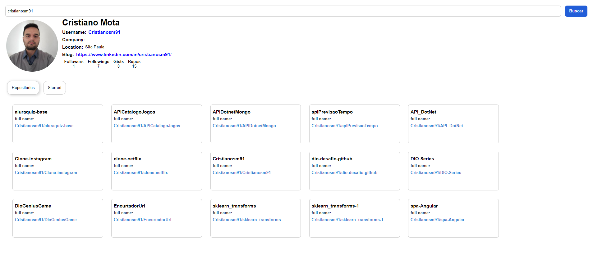

### Features

- Search infos by username
- Search repo by username
- Search starred by username

### Preview

Print of the finished project.

### Libraries used

- [axios](https://www.npmjs.com/package/axios)           --> to Install -> npm i axios
- [react-tabs](https://www.npmjs.com/package/react-tabs) --> to Install -> npm install --save react-tabs
- [styled-components](https://styled-components.com/)    --> to Install -> npm install --save styled-components

## Available Scripts

In the project directory, you can run:

### `npm start`

Runs the app in the development mode.\
Open [http://localhost:3000](http://localhost:3000) to view it in your browser.

The page will reload when you make changes.\
You may also see any lint errors in the console.

### Original Project

This project was built following Matheus Benites' tutorial on Dio's bootcamp:
https://github.com/benits/github-api-interface
https://www.youtube.com/playlist?list=PLTv2Rbwcr_Cru7KIHcffE1Shg9X9Eix7a